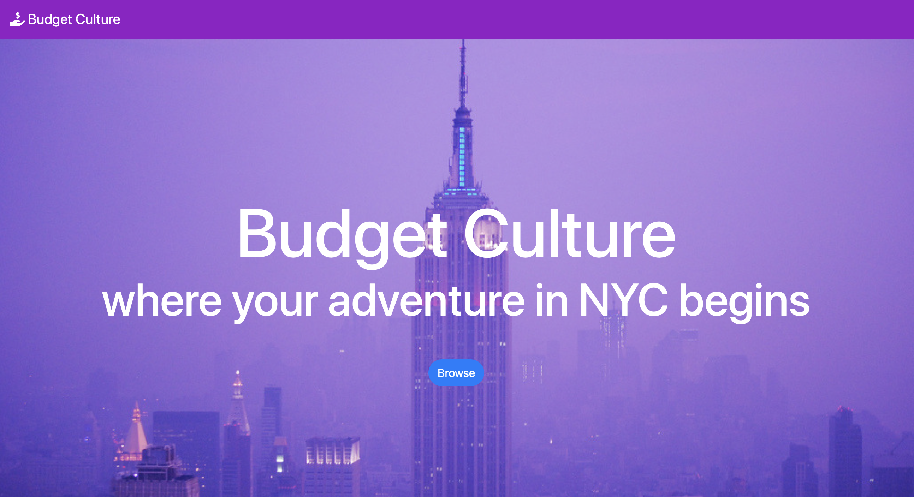
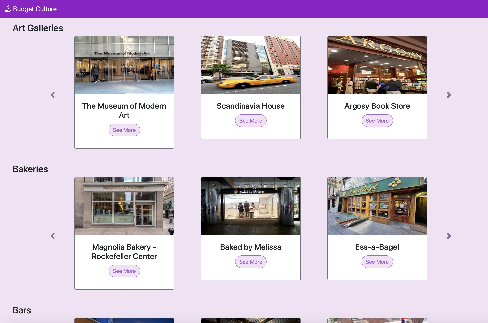

# Budget Culture
Budget Culture is a website where users can browse the activities and attractions in a certain area that are affordable based on their budget. This site was created over a period of 5 days by Julia and Diya during Upperline Code's FinTech Focus program.

## Who are we trying to help?
We want to help people who want to explore the city around them while staying within their budget. Well-known activities and attractions in a city are usually expensive. Budget Culture provides affordable options for its users so they can experience the city without splurging. 

## Why is this project meaningful to us?
We wanted to create something that we could use in our daily lives. Whenever we decide to explore a certain area, we often search online and browse through several websites for activities to do that are within our budget. Especially in a city, things tend to be more expensive. Thus, we created Budget Culture to allow users to find affordable activities all in one website.

## We are most proud of...
We are most proud of formatting our website for easy readability and making it look aesthetically pleasing. We are also proud of using the Google Maps Places API to get data on activities in a city.

## Current Features
Users can...
- Browse different attractions in NYC by category.
- Obtain the name, location, and rating of a location.
- Check if the location is currently open.

## If we had more time, we would...
1) Implement the Budget and Search options. 
2) Allow users to create their own accounts so they could save different locations/activities they're interested in for the future.
3) Add a feature that would provide different activities near the user's current location.
4) Expand to include more cities. 

## What our website currently looks like...

## July 9, 2021 Update
It has been a lot of fun creating this website together and learning about the world of web development. However, the FinTech Focus program has ended and there are now other new projects that we want to focus on. Thus, this repository will be archived from now on. 
